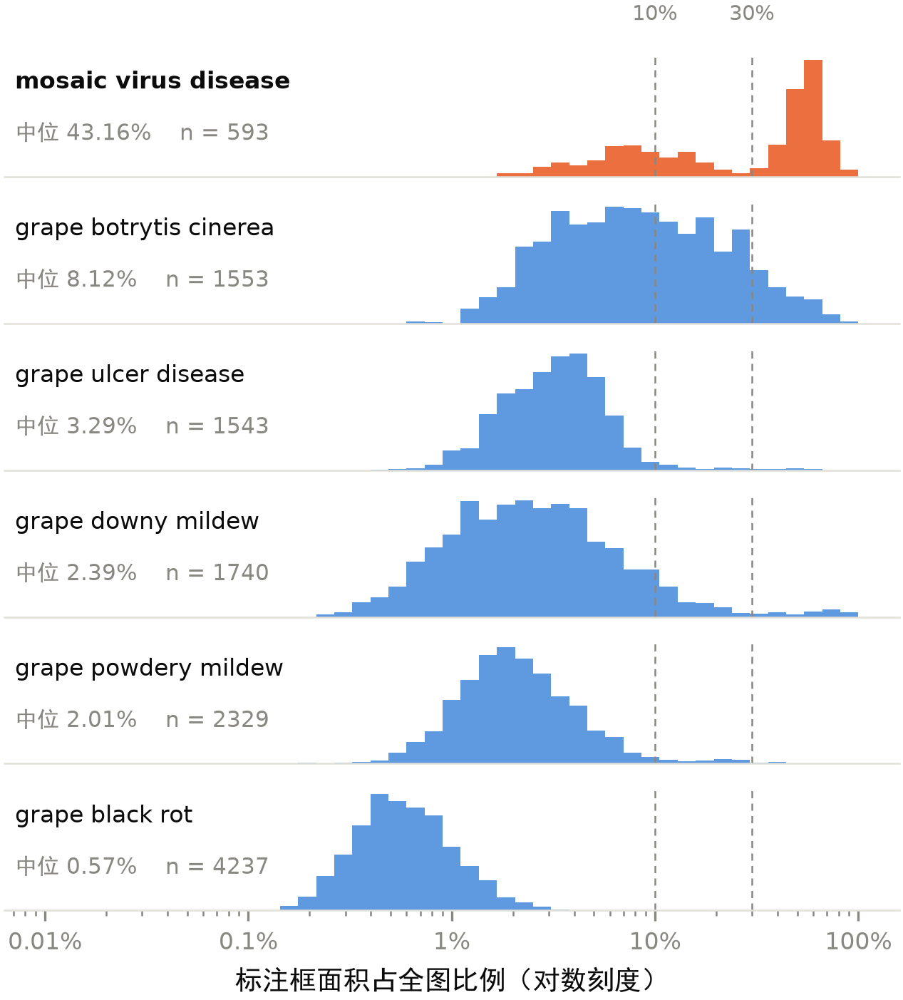
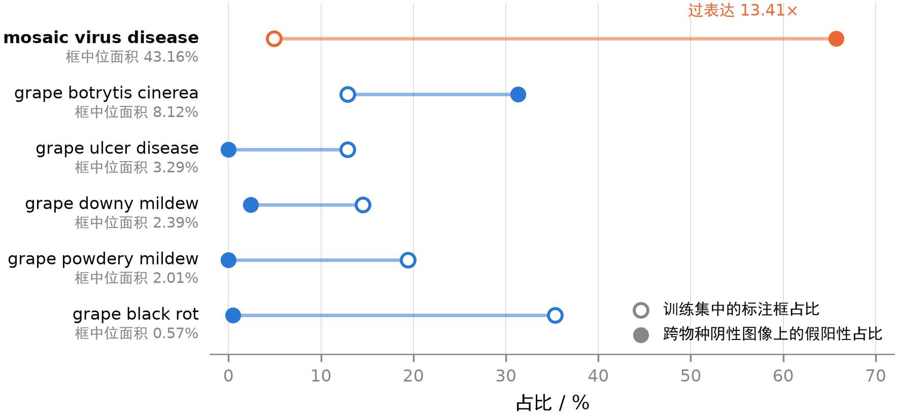
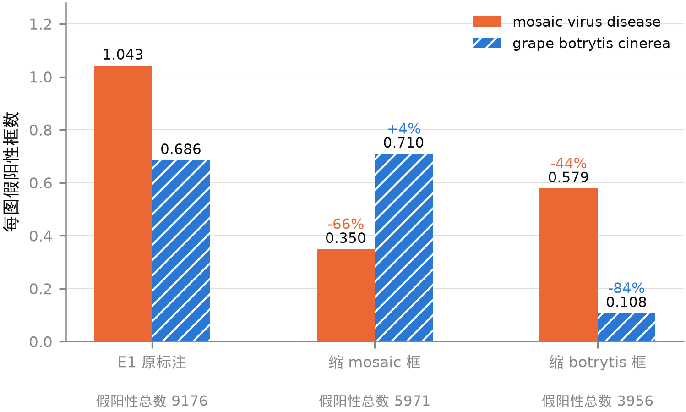

# 公开葡萄病害数据集中的捷径学习：标注粒度不一致的因果作用及其限度

**作者**　`[姓名]`

**单位**　`[学院／专业]`

---

## 摘要

公开数据集是农业病害检测研究的主要数据来源，其可用性通常依据所报告的指标判断，
而指标反映不出标注体系内部是否自洽。本文以一个公开葡萄病害检测数据集
（3288 图，11995 框，6 类）为对象，考察公开数据的哪些固有属性决定检测系统的实际可用性。
五组单变量对照覆盖模型容量 2.58 M 至 32 M、输入分辨率 384 至 960 以及一次检测范式更换，
统一评估口径下测试集 mAP50 极差仅 1.54 个百分点，与随机种子波动同量级；
分尺度评估在五个架构上一致地将瓶颈定位于小目标。主要发现在数据侧：
mosaic virus disease 一类以整叶级标注为主（标注框中位面积占全图 43.16%），
其余五类一致采用病斑级标注（0.57% 至 8.12%）。以 5156 张不含葡萄的跨物种图像作阴性对照，
模型输出的 12221 个假阳性框中 65.7% 归入该类，相对训练占比过表达 13.41 倍，
方向与类别频率先验相反。单变量反事实重训确立了因果关系：仅缩小该类的标注框，
其分布内 AP 由 0.7609 降至 0.4552，其余五类的变化均未超出种子间波动，
跨物种假阳性同时减少 66%；安慰剂对照证实该效应特异于被操纵的类别。
标注粒度约解释该过表达的一半，其余成因尚未确定。
本文另提出一个无需图像与训练即可计算的粒度筛查量，
并以同一口径区分出"一致地粗"与"类别间不齐"两种格局——危险的是后者。
此外，依成像光学关系核算，
毫米级病斑的航拍检测在任何具备作业可行性的高度上均不可达。
该失效模式在分布内评估中不可见，构成公开数据集可用性判断的一个盲区。

**关键词**：捷径学习；标注质量；目标检测；数据集可靠性；小目标检测

---

## 1 引言

### 1.1 背景

葡萄的主要真菌病害具有潜伏期：侵染在特定的温湿度窗口内完成，而肉眼可见的症状
要在其后一至数周才出现。这使得防治的有效窗口与观察到症状的时刻并不重合。

本文作者持续观察了一处家庭种植的葡萄地块。该地块往年的处置方式是在幼果期施药
一次，施药的时机与次数依据经验确定，无监测数据支持。尽管施药如期进行，
果实仍在成熟前约一个月出现发病，症状为果面变黑。

本年度该地块未施药。7 月下旬，果实（此时处于绿果期，未转色）表面出现针尖状
黑色斑点；至 8 月初，同一果穗上多数果粒均带有此类斑点，部分果粒出现中央凹陷的
圆形深色病斑，另有果粒呈现半果褐变与整果褐变；叶片上可见褐色坏死斑与叶缘干枯。
病原尚未经实验室确认，故本文不作定性。

这一过程说明的问题是：**施药时机的判断依赖于症状的观察，而症状出现时，
侵染已经完成。** 早期、客观、可量化的病征观测因此成为改进防治时机的前提，
也是本项目最初的出发点。

棚架或篱架栽培使叶幕在人的头顶展开，霜霉病的油渍状黄斑、白粉病的白色霉层主要出现在
叶片正面，而人在架下只能看到叶背。低空俯视观察相对于人工地面观察的价值即在于此。

需要说明的是，本文全部实验使用地面近摄图像，无人机不构成本文的实验对象。
飞行相关的结论仅出现在 5.1 节，且只依赖成像光学关系。

### 1.2 问题

本文围绕一个统领性问题展开：**公开数据集的哪些固有属性，决定了在其上训练的检测系统
是否真正可用？** 该问题分解为三个子问题，分别由本文的三个部分回答：现有方法在这份
数据上能达到什么程度（第 3 节）；若达不到，制约来自模型容量、输入信息还是数据本身
（3.2、3.3 节）；分布内的高指标能否作为实际可用的依据（第 4 节）。5.1 节讨论的采集
可行性是同一问题在采集环节的延伸——数据在被标注之前，先要在光学上存在。

第三个子问题是本文的重点。它之所以要紧，是因为回答错了不会立刻暴露：
模型照常输出，格式正常，置信度合理，而结论是错的。

### 1.3 本文工作

- 以统一评估口径完成五组单变量对照，确定该数据条件下的性能上限，
  并以五种子重复给出组间比较所需的噪声基准；
- 分尺度评估在五个架构上复现，将瓶颈定位于小目标，
  并指出该改善为聚合指标所掩盖；
- 量化类别之间标注粒度的不一致，设计跨物种阴性对照，
  在 5156 张图像上验证由此诱发的捷径学习；
- 以单变量反事实重训确立标注粒度与该捷径的因果关系，
  以安慰剂对照验证效应的特异性，并给出该归因的限度；
- 提出一个无需图像与训练即可计算的粒度筛查量 *R*，
  并以同一口径在两个数据集上区分出"一致地粗"与"类别间不齐"两种格局；
- 核算病斑级航拍检测的光学可行性边界。

### 1.4 相关工作

**捷径学习。** 模型在训练分布内取得高分，却依赖与任务无关的表层线索，
这一现象已被系统归纳为捷径学习[1]。其典型表现是分布内指标
正常而分布外急剧退化，且从聚合指标上无法察觉。医学影像领域的经典案例是模型
依据胸片上的院内标记而非病灶作出判断[2]；自然图像领域则有
模型依赖场景上下文而非目标本身进行识别的报告[3]。
归因方法的研究亦表明，部分在基准上表现优异的模型实际依据的是图像中的无关区域[4]。

已有工作与本文的差别在三处。其一，多数案例针对图像分类，目标检测中的捷径报道
较少；检测任务中标注框的尺度本身构成一个可被利用的信号，这是分类任务所没有的
通道。其二，多数研究将捷径归因于**图像内容**——背景、水印、拍摄设备痕迹——
而本文定位到的诱因位于**标注体系**：图像本身无异常，每个标注框单独看也都正确，
问题出在类别之间标注粒度的不一致。其三，多数工作止于现象描述与事后归因，
本文以单变量反事实重训（4.4 节）确立了标注粒度与该捷径之间的因果关系，
并以安慰剂对照验证了效应的特异性。

**数据集标注质量。** 主流基准数据集中存在可观数量的标签错误，且这些错误足以
改变模型排序[5]；对基准标注的重新审视也表明，原始标注协议
本身会限制评估的有效性[6]。本文关注的不是标签**错误**——
本文所用数据集中的每个框都框住了真实的病征——而是标签**不一致**：同一数据集内，
一类以整叶级标注为主，其余五类采用病斑级标注（2.1 节）。这类问题不会被标签
纠错方法检出，因为不存在错误的标签，只存在不统一的粒度；它在分布内评估中同样
不可见，甚至表现为该类的 AP 最高（表 7）。据我们所知，检测数据集内部标注粒度
不一致所诱发的捷径，此前未见系统报告。

**农业病害视觉识别。** 该领域的公开数据以 PlantVillage 及其衍生数据集为主[7]，
在其上报告的分类准确率普遍很高[8]。但后续工作指出，
此类数据多在受控背景下采集，模型可仅凭背景信息完成分类，其高准确率并不反映
田间条件下的能力[9]。为缓解这一问题，田间条件下采集的
数据集相继发布[10]。

已有批评主要指向**采集条件**（受控背景、离体单叶、光照统一），本文指向的则是
**标注体系**。二者是相互独立的缺陷维度：本文所用的葡萄病害数据集在采集条件上
本身是混合的——既包含背景虚化的影棚式近摄，也包含手持病穗的田间实拍，
另有由多张照片拼合而成的图像（2.1 节）——但无论采集条件如何，
标注粒度的不一致贯穿其中。这意味着改善采集条件并不能消除本文所述的问题：
若在重建数据集时沿用不统一的标注规范，同样的捷径会被带入新数据。

**小目标检测与评估口径。** 小尺寸目标的检测精度显著低于大目标，这一差距在多种
架构上稳定存在[11]；切图推理是常用的缓解手段之一[12]。
在评估侧，已有工作指出聚合指标会掩盖具体的失效模式，
主张对检测误差按类型分解[13]。本文 3.3 节给出的是同一问题在
**尺度维度**上的一个实例：提高输入分辨率使小目标 AP 显著提升（p = 0.018），
而聚合的 mAP50-95 无变化（p = 0.731），仅依据后者会得出与事实相反的结论。
5.1 节进一步指出，在航拍场景中该问题无法通过检测方法缓解——当目标在成像面上
不足一个像素时，其信息在采集环节即已丢失。

---

## 2 数据与实验设置

### 2.1 数据集

主实验采用 Roboflow Universe 上发布的葡萄病害检测数据集 **grape**
（工作区 `wscs`，项目标识 `grape-uyimv`，版本 1，发布日期 2025-11-03，
许可 CC BY 4.0，地址 https://universe.roboflow.com/wscs/grape-uyimv ），
3288 张图像、11995 个标注框、6 个类别，按 2631／329／328 划分。
图像经平台预处理为 640×640（EXIF 方向校正后拉伸缩放），未施加图像增广。
标注对象为病斑级目标，单图平均 3.65 个框。该数据集由平台用户发布，未署名作者，
按 CC BY 4.0 的要求，此处以上述地址作为出处标注。

**表 1 类别分布**

| 类别 | 标注框数 | 占比 | 主要症状形态 |
|---|---|---|---|
| grape black rot | 4237 | 35.3% | 褐色圆斑，边界清晰 |
| grape powdery mildew | 2329 | 19.4% | 白色粉状霉层，成片分布 |
| grape downy mildew | 1740 | 14.5% | 叶面油渍状黄斑 |
| grape botrytis cinerea | 1553 | 12.9% | 灰色霉层，侵染果穗枝干 |
| grape ulcer disease | 1543 | 12.9% | 枝干组织褐变坏死 |
| mosaic virus disease | 593 | 4.9% | 整叶花斑畸形 |

最多与最少类别之比为 7.1:1，属可接受范围，故全部类别参与训练，未做重采样。

统计各类标注框面积占全图的比例，可见一处明显差异：

**表 2 各类标注框的面积占比**

| 类别 | 中位 | 均值 | P90 |
|---|---|---|---|
| mosaic virus disease | **43.16%** | 36.08% | 64.85% |
| grape botrytis cinerea | 8.12% | 13.02% | 29.47% |
| grape ulcer disease | 3.29% | 3.96% | 6.19% |
| grape downy mildew | 2.39% | 4.74% | 8.87% |
| grape powdery mildew | 2.01% | 2.95% | 4.93% |
| grape black rot | 0.57% | 0.69% | 1.21% |

mosaic virus disease 的框中位面积为第二大类别的 5.3 倍、最小类别的 76 倍。

进一步考察该类的分布形态可以发现，其标注粒度**在类内亦不统一**：593 个标注框中，
58% 的面积大于全图的 30%（对应整片叶片），28% 小于 10%（对应局部病斑），
分位数为 P10 = 5.3%、P25 = 8.9%、中位 43.2%、P75 = 57.6%，呈双峰形态。
作为对照，grape botrytis cinerea 仅 10% 的框大于 30%。

因此准确的表述是：该类以整叶级标注为主但混有病斑级标注，而其余五类一致采用
病斑级标注。核查图像可确认这一判断。第 4 节的全部分析由此展开。

**图 1**　六类标注框相对面积的分布（对数横轴，虚线为 10% 与 30% 两条判定线）。
五类病斑级标注的分布集中于 10% 以下；mosaic virus disease 单独位于另一量级，
且呈明显双峰——右峰对应整叶级标注，左峰对应混入的病斑级标注。

数据集中另可观察到由多张照片拼合而成的图像。在一例中，同一张图内左上区域的
叶片照被标注为 mosaic virus disease（占全图 15.4%），而右侧的果粒区域标注了
9 个 grape powdery mildew 的小框——**两种粒度出现在同一张图像内**，
是标注规范不统一的直接体现。

此处需避免一种过度推广：本文的论断不是"标注框越大则 AP 越高"。
grape botrytis cinerea 的框面积居第二位，其 AP 却是六类中最低的（表 7）。
本文的论断仅针对 mosaic virus disease 一类所形成的具体捷径，
以及 4.4 节安慰剂对照所显示的、粗标注类别共有的一项全局效应。

阴性对照与前期流程验证采用 FieldPlant 数据集[10]
（Roboflow Universe，工作区 `plant-disease-detection`，项目 `fieldplant`，版本 11，
CC BY 4.0；5156 图，27 类，涵盖木薯、玉米、番茄），
相关观察见 5.2 节，阴性对照的用法见 4.2 节。

### 2.2 实验设置

全部实验遵循单一变量原则：同一数据集与划分，训练轮次、等效批量、优化器策略、
硬件环境一致。

| 项目 | 设置 | 说明 |
|---|---|---|
| 训练轮次 | 50 | E5 实际训至第 16 轮中断，见 5.3 节 |
| 等效批量 | 8 | E5 以 4×2 梯度累积实现；E4 为 4，未对齐 |
| 优化器 | auto / AdamW | 学习率由框架确定 |
| 混合精度 | 开启 | YOLO 为 AMP，RF-DETR 为 bfloat16 |
| 显卡 | RTX 4060 Laptop 8 GB | 消费级笔记本显卡 |
| 框架 | PyTorch 2.13.0+cu132 | Ultralytics 8.4.106[15] / RF-DETR 1.8.3[16] |
| 随机种子 | 0，deterministic | |

E4（RT-DETR-l[17]）的等效批量为 4，与其余组不一致，不构成严格单变量对照。
本文仍如实报告该组——它以 32 M 参数、不同检测范式，结果与其余组打平，
这一点支持本文关于模型侧优化空间的判断。

E5 的训练在第 16 轮中断，表现为数据加载速度无法匹配 GPU 的计算速度。
当时未对瓶颈作进一步定位，无法区分其来自磁盘读取还是 CPU 端的预处理。
该问题属于工程环境限制，与模型本身无关；5.3 节给出了所用权重具有代表性的验证。

### 2.3 评估口径

全部指标在测试集上报告，测试集在训练与调参全程未使用，验证集仅用于选取权重。
该区分具有实际意义：E1 的验证集 mAP50 为 0.872，测试集为 0.8357，相差 3.6 个百分点。

指标一律由 pycocotools（COCO 官方评估实现[14]）计算，置信度阈值 0.01。
该口径必须统一——
同一份 E1 权重，Ultralytics 内置评估器给出 0.845，pycocotools 给出 0.8357，
差 0.9 个百分点，与本文所要讨论的组间差异是同一量级。混用两套口径的比较不成立。

---

## 3 性能上限与瓶颈

### 3.1 五组对照

**表 3 测试集结果（统一 pycocotools 口径）**

| 编号 | 模型 | 参数量 | 分辨率 | 批量 | mAP50 | mAP50-95 |
|---|---|---|---|---|---|---|
| E1 | YOLO11n | 2.58 M | 640 | 8 | 0.8357 | 0.5159 |
| E2 | YOLO11s | 9.42 M | 640 | 8 | 0.8493 | 0.5168 |
| E3 | YOLO11n | 2.58 M | 960 | 8 | 0.8459 | 0.5130 |
| E4 | RT-DETR-l | 32 M | 640 | 4 | 0.8427 | 0.5220 |
| E5 | RF-DETR-Nano | 30.2 M | 384 | 8 | 0.8511 | 0.5230 |

mAP50 极差 1.54 个百分点，mAP50-95 极差 1.00 个百分点。该区间覆盖参数量 12.4 倍、
像素面积 6.25 倍的跨度，以及一次检测范式的更换。

该 1.54 个百分点的极差不足以支撑组间排序，依据有二。

其一为间接证据：E2 与 E3 在测试集上均高于 E1，在验证集上则均低于 E1，方向相反。

其二为直接证据：对 E1 的配置（YOLO11n@640）另换四个随机种子重复训练，
其余设置逐项不变，连同 seed 0 共五次运行，在同一评估管线下得到：

**表 4 同一配置的五种子重复（YOLO11n@640，n=5）**

| 指标 | 均值 | 标准差 |
|---|---|---|
| mAP50 | 0.8249 | 0.0069 |
| mAP50-95 | 0.5076 | 0.0063 |
| AP_small | 0.1663 | 0.0080 |
| AP_medium | 0.3661 | 0.0245 |
| AP_large | 0.5865 | 0.0080 |

同一配置的 mAP50 标准差为 0.69 个百分点。表 3 中五组配置之间的极差
1.54 个百分点约合 2.2 个标准差——而从同一分布中抽五次，期望极差本就在
2.3 个标准差左右。观测到的组间差异完全可以由随机种子解释。

两点补充说明。

其一，表 3 各组报告的是 seed 0 的单次结果。就 E1 而言，seed 0 恰是五次中
最高的一次（0.8357），比五种子均值高 1.08 个百分点——这一偏差量级与组间
极差 1.54 个百分点相当。以单次运行作组间比较，在本数据规模下并不可靠。

其二，重复次数本身也需要足够。以 AP_medium 为例，前三个种子的结果为
0.3788／0.3820／0.3847，标准差仅 0.0030，看似极稳；补至五个种子后
（加入 0.3263 与 0.3588）标准差升至 0.0245，为原先的 8 倍。
n=3 时的方差估计会严重低估真实波动，据此判断显著性容易得出错误结论。

同一批权重的**逐类别** AP 波动另行统计，用作 4.4 节反事实比较的噪声参照，
数值列于表 10 末列。各类别的相对标准差介于 1.0% 与 5.6% 之间，
其中实例数最少的 grape botrytis cinerea（测试集 117 个实例）波动最大，
五次运行的相对极差达 15.5%。**逐类别指标的种子间波动明显大于聚合指标，
单次运行的逐类别比较须以此为噪声下界。**

### 3.2 分尺度：瓶颈在小目标

**表 5 五组实验的分尺度性能**

| 编号 | AP_small | AP_medium | AP_large | large/small |
|---|---|---|---|---|
| E1 | 0.1567 | 0.3788 | 0.5967 | 3.81× |
| E2 | 0.1642 | 0.4275 | 0.5847 | 3.56× |
| E3 | 0.1856 | 0.4520 | 0.5852 | 3.15× |
| E4 | 0.1927 | 0.4357 | 0.5969 | 3.10× |
| E5 | 0.1614 | 0.3282 | 0.5982 | 3.71× |

大目标的 AP 为小目标的三至四倍，五个架构无一例外。这表明制约性能的并非模型对病害
视觉特征的表达能力，而是目标的尺度本身；更换架构不能消除该差距。
尺度分档依 COCO 的定义（small 为面积小于 32×32 像素）[14]。

### 3.3 分辨率的效果为聚合指标所掩盖

E3 与 E1 的唯一差别是训练与推理分辨率（960 对 640）。依整体指标判断，该组毫无收益；
但对两组各作五个种子的重复之后，分尺度的结果与整体指标给出的图景截然不同。

**表 6 E1@640 与 E3@960 的分尺度比较（各五种子，Welch t 检验）**

| 指标 | E1 (n=5) | E3 (n=5) | 差值 | t | p |
|---|---|---|---|---|---|
| mAP50 | 0.8249 ± 0.0069 | 0.8370 ± 0.0096 | +1.20 pp | 2.28 | 0.055 |
| mAP50-95 | 0.5076 ± 0.0063 | 0.5055 ± 0.0116 | −0.21 pp | −0.36 | 0.731 |
| **AP_small** | 0.1663 ± 0.0080 | 0.1798 ± 0.0060 | **+1.35 pp** | 3.02 | **0.018** |
| AP_medium | 0.3661 ± 0.0245 | 0.4183 ± 0.0483 | +5.22 pp | 2.15 | 0.075 |
| AP_large | 0.5865 ± 0.0080 | 0.5809 ± 0.0103 | −0.56 pp | −0.96 | 0.367 |

**小目标 AP 的提升达到统计显著（p = 0.018），而整体 mAP50-95 完全没有变化
（−0.21 个百分点，p = 0.731）。**

关于多重比较需作说明。表 6 同时报告了五个指标，若一律按 α = 0.05 判断，
存在多重比较问题。但 **AP_small 是本文事前指定的主要终点**：3.2 节已在五个
架构上独立认定小目标为性能瓶颈，本节正是为检验"提高分辨率能否缓解该瓶颈"
而设计，该假设在实验开展之前即已确立。其余四项为次要指标，仅作参考，
本文不对其单独下结论。

关于重复次数亦需说明。3.1 节指出 n = 3 会低估方差，同一质疑原则上也适用于
n = 5。就本文所报的结论而言：AP_small 的标准差由 n=3 的 0.0094 变为 n=5 的
0.0080，相对稳定；而 AP_medium 由 0.0030 变为 0.0245，变动剧烈。
本文仅对前者下结论，对后者只报告趋势，正是基于这一差异。

这是本文关于评估方式的主要观察：聚合指标掩盖了瓶颈区间的真实改善。若仅以
mAP50-95 判断，会得出"提高分辨率无效"的结论，而实际上它恰恰改善了本文
第 3.2 节所认定的瓶颈——小目标检测。

中目标的效应量更大（+5.22 个百分点，约为小目标的四倍），却未达显著（p = 0.075），
原因是该指标的种子间波动本身很大（E1 的标准差 0.0245，E3 为 0.0483，
分别是小目标标准差的 3 倍与 8 倍）。**AP_medium 在本数据上是一个不稳定的指标**，
这一点在设计后续实验时需要注意——它需要更多重复才能支撑同等强度的结论。

### 3.4 召回率的尺度依赖

E5 的平均召回率随允许输出的框数呈阶梯上升：maxDets 为 1 时 0.2676，10 时 0.5874，
100 时 0.6729，尚未饱和。RF-DETR 使用固定数量的学习式查询（本实验为 300 个），
图像内目标数超过查询数时输出将被截断。真实场景下单片叶片可能带有数十个病斑，
该限制在部署时需予以考虑。

### 3.5 类别层面分析

**表 7 各类 AP50-95**

| 类别 | 测试集实例 | E1 | E2 | E3 | E4 | E5 |
|---|---|---|---|---|---|---|
| grape black rot | 446 | 0.5668 | 0.5742 | 0.5620 | 0.5764 | 0.5649 |
| grape botrytis cinerea | 117 | 0.3454 | 0.3403 | 0.3167 | 0.3839 | 0.3801 |
| grape downy mildew | 170 | 0.4962 | 0.4925 | 0.5077 | 0.4579 | 0.4962 |
| grape powdery mildew | 313 | 0.3711 | 0.3816 | 0.3870 | 0.3892 | 0.4005 |
| grape ulcer disease | 133 | 0.5549 | 0.5689 | 0.5511 | 0.5609 | 0.5061 |
| mosaic virus disease | 63 | 0.7609 | 0.7435 | 0.7537 | 0.7636 | 0.7903 |

在置信度 0.25、IoU 0.5 这一常用工作点上统计混淆矩阵，结果与预期不符：
类间混淆几乎不存在（非对角元素合计仅 4 个），错误几乎全部来自漏检与背景误报。

**表 8 E1 的检出情况（conf ≥ 0.25，IoU ≥ 0.5）**

| 类别 | 实例数 | 正确检出 | 误判为他类 | 漏检 | 背景误报 | 召回率 |
|---|---|---|---|---|---|---|
| grape black rot | 446 | 420 | 0 | 26 | 36 | 94% |
| grape botrytis cinerea | 117 | 83 | 0 | 34 | 57 | 71% |
| grape downy mildew | 170 | 144 | 0 | 26 | 54 | 85% |
| grape powdery mildew | 313 | 241 | 0 | 72 | 157 | 77% |
| grape ulcer disease | 133 | 113 | 4 | 16 | 39 | 85% |
| mosaic virus disease | 63 | 58 | 0 | 5 | 16 | 92% |
| **合计** | **1242** | **1059** | **4** | **179** | **359** | **85%** |

全部 1242 个真值实例中，被判为其它类别的仅 4 个
（grape ulcer disease 3 个判为 grape botrytis cinerea、1 个判为 grape powdery mildew），
占 0.32%；而漏检 179 个、背景误报 359 个。

grape botrytis cinerea 的 AP 最低（0.3454），其原因并非与 grape ulcer disease
难以区分——二者之间的误判仅 3 例——而是召回率只有 71%，近三成实例未被检出，
同时伴有 57 个背景误报。grape powdery mildew 的背景误报最多（157 个），
其 AP 亦偏低（0.3711）。

**本数据上的主要误差来源是定位而非分类。** 模型的失败发生在"能否找到目标"
这一环节，而非"找到之后判为哪一类"。这与 3.2 节的分尺度结论一致：
瓶颈在于小尺寸目标的检出，而非病害类别的可分性。

需要说明，本文早先曾依据 Ultralytics 输出的归一化混淆矩阵图，判断
grape botrytis cinerea 与 grape ulcer disease 存在严重互混。
以原始计数复核后该判断不成立，此处予以更正。

此处出现一项反常：mosaic virus disease 的测试集实例最少（63 个），
其 AP 却在五个架构上均列第一。样本量最少的类别取得最高得分，
与通常的规律相悖；结合表 2 所示的标注面积差异，两项线索指向同一处。

---

## 4 捷径学习

### 4.1 假设

两项观测指向同一个类别：其标注框比其余类别大一个数量级（表 2）；
其样本量最少而 AP 最高（表 7）。

由此提出假设：模型在该类上的高分并非源于对花叶病毒症状的识别，
而是标注粒度的差异提供了一条可被利用的捷径。

### 4.2 跨物种阴性对照

检验该假设需要一批可确定不含葡萄花叶病毒的图像。自采的 10 张手机照片不能胜任：
样本量过小，且"某片叶片是否感染花叶病毒"只能依靠肉眼判断，缺乏客观真值。

改用 FieldPlant 的 5156 张图像。其拍摄对象为木薯、玉米与番茄，
不可能含有葡萄花叶病毒，因此模型在其上输出的任何葡萄病害均为假阳性，
真值客观且无需人工判定。评估使用 E1 权重，置信度阈值 0.25。

**表 9 假阳性的类别分布（全分辨率解码）**

| 类别 | 训练框面积 | 训练占比 | 预测占比 | 过表达 |
|---|---|---|---|---|
| mosaic virus disease | 43.16% | 4.9% | 65.7% | **13.41×** |
| grape botrytis cinerea | 8.12% | 12.9% | 31.3% | 2.42× |
| grape downy mildew | 2.39% | 14.5% | 2.4% | 0.16× |
| grape black rot | 0.57% | 35.3% | 0.5% | 0.02× |
| grape powdery mildew | 2.01% | 19.4% | 0.0% | 0.00× |
| grape ulcer disease | 3.29% | 12.9% | 0.0% | 0.00× |

5156 张里有 3697 张（71.7%）产生了输出，共 12221 个假阳性框。
其中 1408 张（27.3%）以超过 0.5 的置信度被判为葡萄花叶病毒，744 张超过 0.7，
最高一张 0.948。

**图 2**　各类别在训练集中的标注框占比（空心）与在跨物种阴性图像上的假阳性占比
（实心），按训练框中位面积自上而下递减排列。除 mosaic virus disease 外，
所有类别的假阳性占比均低于其训练占比；唯独标注最粗、训练占比最低的该类反向大幅
升高，由 4.9% 升至 65.7%。

**一项必要的排除。** 过表达最严重的恰好是训练集中最稀有的类别（4.9%）。
类别频率先验只会使高频类被过度预测，方向与观测相反（Spearman 相关系数 −0.638）。
该偏置因此不能归因于类别不平衡。

**两项混淆因素的辨析。** 需要区分"为何会出现假阳性"与"假阳性为何集中于某一类"，
二者是不同的量，本文的论断只涉及后者。

其一，训练集几乎不含无病征的纯健康图像，模型未曾见过"无病征"这一状态。
这足以解释假阳性的总体水平（71.7% 的图像产生了输出），但不能解释其类别分布——
健康负样本的缺失对六个类别没有方向性，无法说明为何 65.7% 的假阳性集中于
训练占比最低的那一类。更关键的是，该因素在 4.4 节的三组反事实中保持恒定：
三组使用同一批训练图像，同样不含健康样本，组间唯一的差别是标注框的尺寸。
因此它影响假阳性的**水平**，不影响组间的**差分**，而本文的因果论断建立在后者之上。
健康负样本的独立效应需另设实验测定，列为后续工作（第 6 节）。

其二，FieldPlant 与主数据集除作物种类外，采集条件亦不相同，
假阳性总量中包含域偏移的贡献。该因素同样只作用于水平而不作用于类别分布，
且 4.4 节的三组反事实在同一批阴性图像上比较，域偏移对三组是共同的。

### 4.3 一个未获支持的解释

我们原先将该现象归因于一条具体规则：画面中存在占大面积的、叶片形状的绿色区域时，
模型即判为花叶病毒。该规则表面合理，但经检验不成立。

对每张图计算最大绿色连通区域占比，与该类预测的出现率对照：

| 最大绿色区域占比 | 图像数 | 出现该类预测的比例 |
|---|---|---|
| 0.00–0.05 | 31 | 6.5% |
| 0.05–0.15 | 171 | 14.6% |
| 0.15–0.30 | 678 | 40.7% |
| 0.30–0.50 | 1222 | 52.6% |
| 0.50–0.70 | 1230 | 51.7% |
| 0.70–1.01 | 1824 | 30.4% |

分组比例呈倒 U 形，但整体相关系数仅 −0.092，实质为零；
无输出图像与有输出图像的绿色区域占比中位数分别为 0.570 与 0.586，二者不可区分。
此外，该类预测框的面积中位数仅 3.8%，并未复现训练标注中的 43.2%。

**该解释应予撤回。** 现象本身是稳固的，但模型所依据的具体图像特征尚不清楚。

### 4.4 反事实重训

图像层面的触发特征既未能定位，转而直接在数据一端操纵变量。

构造两份反事实数据集，训练超参与 E1 逐项一致：

**shrink 组**保留该类及其全部样本，仅将每个标注框裁至中心 25% 面积，
中位面积占比由 43.16% 降至 10.79%，与 grape botrytis cinerea 同量级。
图像、框数、类别数与类别身份均不变，唯一改变的是标注粒度。

该操作成立的前提是：花叶病毒的症状为全叶弥漫性花斑而非局部病斑，
裁至中心后框内仍为真实的症状组织。对黑腐病一类的局部圆斑则不成立，
故该操作只施加于本类。

需要说明的是，该类中约 28% 的标注框原本即为病斑级（面积小于 10%，见 2.1 节），
对这部分框施加同样的裁剪会使其进一步缩小。我们未对两部分作区别处理，
以保持操作的单一性。这一处理对两类指标的影响方向不同，需分别说明：

就**跨物种假阳性**而言，真正实现"整叶级→病斑级"转换的仅占该类的 58%，
其余部分的裁剪与本节假设无关，相当于稀释了处理强度，
因此所测得的 −66% 是对该效应的**保守估计**。

就**分布内 AP** 而言，对原本已经很小的框继续裁剪会额外增加检测难度，
可能使 AP 的下降幅度被高估。这一点与下文所述的主要效度威胁同源，
应合并考虑。

**drop 组**直接剔除该类。该组的训练图像由 2631 降至 2354（减少 10.5%，
因部分图像仅含该类标注），存在样本量的混淆，故只作旁证。

判据在实验开展之前即已确定：shrink 组在 FieldPlant 上的过表达若显著回落，
则标注粒度对该捷径具有因果作用。

> 本节的跨物种测试统一采用 1/4 分辨率解码。FieldPlant 为约 1300 万像素的原图，
> 全分辨率解码的耗时为 1/4 分辨率的 3.4 倍，而图像最终均需缩放至 640 输入模型。
> 基线 E1 在该设置下重新测定，过表达为 11.95×（全分辨率下为 13.41×）。
> 三组设置一致，组内可比。

**结果一：分布内的异常高分随粒度归一化而消失**

两组各在其自身的标注体系下评估——shrink 组的测试集标注同步缩小——
指标由 pycocotools 计算，与表 3、表 7 同口径。
末列为同一配置五个随机种子的逐类别 AP 相对极差（3.1 节），作为噪声参照。

**表 10 缩框前后的分布内逐类 AP50-95（统一 pycocotools 口径）**

| 类别 | E1 原标注 | shrink 组 | 变化 | 种子间相对极差（n=5） |
|---|---|---|---|---|
| mosaic virus disease | 0.7609 | 0.4552 | **−40.2%** | 3.2% |
| grape black rot | 0.5668 | 0.5600 | −1.2% | 2.5% |
| grape botrytis cinerea | 0.3454 | 0.3184 | −7.8% | 15.5% |
| grape downy mildew | 0.4962 | 0.4785 | −3.6% | 8.2% |
| grape powdery mildew | 0.3711 | 0.3809 | +2.7% | 5.8% |
| grape ulcer disease | 0.5549 | 0.5503 | −0.8% | 2.1% |

未被操纵的五类，其测试集标注在两份数据中逐字相同，实测 AP 的变化均小于该类自身的
种子间波动，即在本文的分辨能力下不可区分；被操纵的类别下降 40.2%，
为其种子间相对极差（3.2%）的 12.6 倍。该类由遥遥领先的第一
（0.7609，第二名 0.5668）落至六类中的第四（0.4552）。
表 7 中"样本最少却得分最高"的反常，随标注粒度的归一化而消失。

需说明评估方式的选择。以 E1 权重直接在缩框后的测试标注上评估，该类 AP 为 0：
框面积缩至原来的 25%，同心框的 IoU 上界即为 0.25，两套标注体系在 IoU ≥ 0.5 下
几乎不重叠。因此只能令各组在各自的标注体系下评估，
比较的是"该类相对其余五类的位次"，而非跨标注体系的绝对数值。

**结果二：跨物种假阳性大幅下降**

**表 11 反事实重训在 FieldPlant 上的假阳性（1/4 分辨率解码）**

| 组别 | 该类假阳性框 | 过表达 | 假阳性总数 |
|---|---|---|---|
| E1 原标注（框 43.2%） | 5379 | 11.95× | 9176 |
| shrink 组（10.8%） | 1805（−66%） | 6.16×（−48%） | 5971 |
| drop 组 | 0 | — | 7056 |

**结果三：剔除该类未能消除问题**

**表 12 剔除目标类后假阳性的转移（1/4 分辨率解码）**

| 类别 | 训练框中位面积 | E1 | drop 组 |
|---|---|---|---|
| grape botrytis cinerea | 8.12% | 3537 | 5350（+51%） |
| grape downy mildew | 2.39% | 215 | 1225（+469%） |

假阳性转移至标注次粗的类别。这表明捷径依附的并非 mosaic virus disease
这一特定病害，而是**标注粒度最粗的那一类**——分布外输入会被系统性地归入其中。
这同时解释了 shrink 组（假阳性总数 5971）何以优于 drop 组（7056）：
前者改变了产生捷径的条件，后者仅移除了承接该捷径的类别。

**两点保留**

其一，标注粒度并非全部成因。缩框之后仍存在 6.16 倍的过表达，
粒度约解释其中一半，其余部分的成因尚不清楚。

其二，最主要的效度威胁在于：缩小标注框本身即提高了检测难度，
AP 的下降不必然指示捷径的存在。对此有两点回应。
一方面，任务难度的提高无法解释跨物种假阳性减少 66%，后者与标注框的尺寸无直接关系，
两项结果需合并解释方能成立。
另一方面，归一化之后该类的 AP 为 0.4552，与框面积同量级的 grape downy mildew（0.4785）、
grape botrytis cinerea（0.3184）处于同一区间——该尺度的目标并非不可检测，
下降的是该类相对其余类别的**异常优势**，而非其绝对可检测性。

为排除"任何标注扰动均会降低假阳性"这一泛泛解释，另设第三组对照：
保持 mosaic 不变，改缩 grape botrytis cinerea（训练框面积居第二，8.12%）的标注框，
同样缩至 25% 面积（降至 2.03%），其余条件不变。

**表 13 三组反事实的每图假阳性对比（1/4 分辨率解码）**

| 组别 | mosaic | botrytis | 假阳性总数 |
|---|---|---|---|
| E1 原标注 | 1.043 | 0.686 | 9176 |
| 缩 mosaic 框 | **0.350（−66%）** | 0.710（+4%） | 5971 |
| 缩 botrytis 框 | 0.579（−44%） | **0.108（−84%）** | 3956 |

**图 3**　三组反事实在跨物种阴性图像上的每图假阳性框数（1/4 分辨率解码），
百分比为相对 E1 原标注的变化，各组下方标注假阳性总数。
中间一组显示效应的特异性（被操纵的 mosaic 下降 66%，未被操纵的 botrytis 不变）；
右侧一组显示两种机制的方向差异——缩 botrytis 使其自身下降 84% 的同时，
未被操纵的 mosaic 亦下降 44%，与"归属机制"单独作用时应有的上升相反。

效应集中于被操纵的类别：缩 mosaic 使其假阳性下降 66%，而 botrytis 几乎不变（+4%）；
缩 botrytis 则使其自身下降 84%。这排除了"扰动标注即可降低假阳性"的解释。

**两种机制。** 三组结果须由两种机制共同解释，二者的证据来源不同。

*归属机制*：分布外输入被系统性地判入标注最粗的类别。其证据为 drop 组——
剔除 mosaic 后假阳性并未消失，而是转移至次粗的 grape botrytis cinerea（+51%）
与 grape downy mildew（+469%，表 12）。

*倾向机制*：粗标注还整体抬高了模型对陌生输入产生输出的倾向。其证据为安慰剂组——
缩小 botrytis 的标注框，在使其自身假阳性下降 84% 的同时，
**未被操纵的 mosaic 亦下降 44%**，且假阳性总数为三组最低（3956）。

两种机制在方向上并不一致，这一点值得注意。若只有归属机制在起作用，
削弱一个粗标注类别应使假阳性向另一个粗标注类别转移，即缩 botrytis 应使 mosaic 的
假阳性上升（drop 组即呈此形态），而实测为下降 44%。
可见削弱任一粗标注类别所降低的，不仅是该类的承接能力，还有模型整体的输出倾向，
且后者的效应量足以覆盖前者。该区分改变了干预策略的含义：
统一标注粒度的收益不限于被修正的那一类，因此不宜只修最粗的一类，
而应对全部粗标注类别一并处理。

### 4.5 该失效模式的特殊危险性

该失效模式的表现不是"未能检出"，而是"稳定地输出同一个错误答案"，其危险性有三。

**置信度高，阈值调节无效。** 将阈值由 0.25 提高至 0.5，误判并不消失：
5156 张阴性图像中仍有 1408 张以 0.5 以上的置信度被判为花叶病毒，744 张超过 0.7。
提高阈值只会同时损失真阳性。

**在常规监控中不可见。** 输出格式正常，置信度分布合理，
不作逐样本的可视化核查即无法察觉。

**其代价高于无输出。** 系统若投入使用，使用者将依据错误结论施药，
其代价高于系统明确报告"无法判断"。

---

## 5 讨论

### 5.1 病斑级航拍检测的可行性边界

我们最初的推理是：小目标 AP 仅 0.16，故需降低地面采样距离，
因而需要两级航线。该推理存在一处缺陷——0.16 测自地面近摄图像，
其是否可外推至航拍视角未经验证。

改由成像光学关系直接核算，不依赖任何跨域假设：

    GSD = 像元尺寸 × 飞行高度 / 焦距

COCO 的尺寸分档在图像上定义，与采集方式无关（small 为面积小于 32×32 像素）[14]。

**表 14 各机型在 30 m 高度的分辨能力**

| 相机 | GSD | 达 32 像素所需的目标尺寸 |
|---|---|---|
| 1/1.3″ 48 MP，f=6.7 mm | 5.33 mm/px | 17.1 cm |
| 4/3 20 MP，f=12.29 mm | 8.00 mm/px | 25.6 cm |
| 1″ 20 MP，f=8.8 mm | 8.22 mm/px | 26.3 cm |
| 1/1.3″ 12 MP 长焦，f=43 mm | 1.66 mm/px | 5.3 cm |

**表 15 使 5 mm 病斑达到给定像素尺寸所需的高度上限（1/1.3″ 48 MP）**

| 要求 | 高度上限 | 单帧覆盖 | 覆盖 1 公顷所需张数 |
|---|---|---|---|
| 达 32 px（脱离 small） | 0.88 m | 1.26 × 0.94 m | 约 14 万 |
| 达 96 px（进入 large） | 0.29 m | 0.42 × 0.31 m | — |

张数按摄影测量常规的航向 80%、旁向 70% 重叠计算。即便按无重叠的理想情形，
覆盖一公顷仍需约 8400 张，结论不受该假设影响。

30 m 高度下，5 mm 病斑只占 0.94 个像素。

**结论是明确的：毫米级病斑的航拍检测，在任何具备作业可行性的高度上均无法实现。**
这属于光学限制而非模型能力问题——当目标在成像面上不足一个像素时，
信息在采集环节即已丢失，任何小目标检测方法都无从施力。
长焦镜头可将最小可分辨尺寸压至 5.3 cm，是其中最有效的手段，
但与毫米级仍相差一个数量级。

因此所需的并非两级*航线*，而是两级*系统*：航拍一级（30–50 m）承担冠层与整株
尺度的异常定位——变色区域、长势异常、缺株，这些目标在 17 cm 以上，光学上可分辨；
病斑级的确诊由地面近摄承担。本文所用的数据集与模型对应的正是后一级。

需强调，上述高度仅为必要条件。该高度下实际可达到的检测精度必须以真实航拍数据测定，
而本文全部实验使用的是地面近摄图像。

### 5.2 数据建设

**先给出一个可在使用数据之前施加的筛查量。** 第 4 节的现象源于标注粒度在类别之间的
不一致，而这种不一致可以在不读取任何图像、不训练任何模型的前提下直接算出：
以类内标注框相对面积的中位数 *m*c 刻画每一类的粒度
（YOLO 归一化标注下相对面积即 *w*×*h*），再以

　　*R* = maxc(*m*c) / medianc(*m*c)

刻画最粗的类别偏离典型类别的程度。分母取类间中位数而非最小值，
以免被单个极细的类别放大。判定阈值先验设定为：*m*c ≥ 30% 记为整叶级
（占全图三成以上的标注框不可能框住单个病斑），*m*c ≤ 10% 记为病斑级，
中间地带不作判定。

*R* 刻画的是"有多不齐"，但不足以刻画"最粗的那一类是否孤立"。
后者由最粗类与次粗类的中位数之比 *m*(1)/*m*(2) 给出，
两项须并列考察：一个数据集可以整体偏粗而队首并无断层，
也可以整体偏细却存在一个孤立的最粗类别。4.4 节的机制依附于"标注最粗的那个位置"，
其成立要求正是后一种情形，因而 *m*(1)/*m*(2) 才是与该机制直接对应的量。

**表 16 两个数据集的标注粒度分布（同一口径）**

| 数据集 | 类别数 | 标注框数 | 类间中位 *m* | 最粗类 *m* | *m*(1)/*m*(2) | 整叶级／病斑级类数 | 粒度跨度 *R* |
|---|---|---|---|---|---|---|---|
| 本文主数据集（葡萄） | 6 | 11995 | 2.84% | 43.16% | **5.32×** | 1／5 | **15.2×** |
| FieldPlant（木薯／玉米／番茄） | 27 | 8580 | 33.49% | 87.46% | 1.06× | 17／1 | 2.6× |

两项指标对小样本类别的敏感程度不同。将参与统计的类别限定为标注框数不少于
10、30、100 个时，主数据集的两项均恒为 15.2× 与 5.32×（其六个类别的标注框数
最少也有 593 个，不受阈值影响）；FieldPlant 的 *R* 稳定在 2.4× 至 2.7×，
而 *m*(1)/*m*(2) 由 1.06× 升至 1.89×——因为剔除小样本类别会改变
排在首位的类别。即便取该区间的上端，仍远低于主数据集的 5.32×。

**两个数据集分属不同的格局，"粗"与"不一致"是两件事。** FieldPlant 的标注整体处于
整叶级——27 类中 17 类的中位面积超过 30%，类间中位数本身即为 33.49%——
但各类彼此接近：最粗的类别仅比次粗者高出 6%（1.06×），队首没有断层。
本文主数据集则相反：五类为病斑级（中位 0.57% 至 8.12%），唯独一类为整叶级
（43.16%），高出类间中位数 15.2 倍、次粗类别 5.3 倍（2.1 节）。

这一对照对第 4 节的机制有直接意义。捷径依附的是**标注最粗的那个位置**（4.4 节），
其成立前提是该位置由某一类别显著地独占。在各类同为粗标注的数据上不存在唯一的
归属地，该机制是否同样成立，本文未作检验（5.3 节）。因此本文的主张应表述为：
**危险的不是标注粗，而是类别之间粒度不齐**。

其实践含义是一条可执行的筛查：使用公开检测数据集之前先算一次 *R*，
代价仅为遍历标注文件（秒级，无需图像与 GPU）。*R* 越大，
越应在训练之前核查最粗的那一类，或统一其标注粒度。

以下各条均由前文结果直接导出。

**标注粒度必须在类别之间统一。** 第 4 节表明，混用整叶级与病斑级标注，
可使模型在分布内评估中于该类取得最高分（0.74 至 0.79），
同时在分布外产生 13.41 倍的过表达假阳性；仅依据分布内指标无法察觉该问题。
4.4 节的安慰剂对照进一步显示，该项要求不限于粒度最粗的类别：
缩小任一粗标注类别的标注框，都会同时降低假阳性总量，
故应对全部粗标注类别一并规范，而非只处理最突出的一类。

**训练集应纳入足量的健康（无病征）样本。** 本文所用公开数据集几乎不含纯健康图像，
模型未曾见过"无病征"这一状态，这可能是 4.2 节中 71.7% 的图像均产生输出的原因之一。
需说明该条与前一条处于不同层次：健康样本的缺失影响假阳性的**总体水平**，
标注粒度的不一致决定假阳性的**类别去向**，二者在 4.4 节的三组反事实中已被分离
（4.2 节）。前者的独立效应本文未作测定，列为后续工作。

**自采数据宜参与训练，而非仅用作测试。** 需要说明，该条系基于前述各条的推论
与既有文献的建议，**本文未对其提供直接实验证据**——4.2 节因样本量不足
（10 张）已将自采数据排除在正式实验之外。此处列出是为后续数据建设提供参考，
其验证有待自采数据集完成标注后另行开展。

**公开数据集须经人工抽样可视化核查，不能仅依据指标判断。** 抽检可发现的不止于错标。
在本文主数据集中，仅通过逐张查看图像即可发现由多张照片拼合而成的样本，
其中同一张图内左上区域的叶片被标注为 mosaic virus disease，
右侧果粒区域则标注了 9 个 grape powdery mildew 的小框——**两种标注粒度出现于
同一张图像之内**（2.1 节）。这类问题不会在任何指标上显现，
却正是第 4 节所述捷径的来源。

前期以 FieldPlant 作流程验证时，抽检标注图亦发现玉米叶被标为番茄类别——
玉米为单子叶、平行叶脉，与番茄的羽状复叶差异明显，属明确的标注错误；
另有严重的标注不全，一张图中清晰可见十余片叶片而实际仅标注 1 至 4 片，
致使模型检出真实存在但未被标注的目标时被计为误报。上述问题均无法由指标发现。

### 5.3 局限

**全部实验使用地面近摄图像，向航拍视角的迁移未经检验。** 本文不对无人机场景下的
检测性能作任何断言，5.1 节的结论只依赖光学关系。

**重复次数仍然有限。** E1 与 E3 各做了五个种子，E2、E4、E5 仍是单次运行。
表 3 的组间比较因此只能表明"差异与种子波动同量级"，不能进一步区分。
若要对具体某两组下结论，需按 3.1 节的方式各做重复。
3.3 节 AP_small 的显著性判断（p = 0.018）同样建立在 n = 5 之上，
虽然该指标的方差估计在 n=3 至 n=5 之间相对稳定（标准差 0.0094 → 0.0080），
但更大规模的重复仍有必要。

**反事实各组亦为单次运行。** 三组反事实（shrink、drop、安慰剂）均以 seed 0 训练一次。
为使单次比较可解释，本文以同一配置五个种子的逐类别 AP 波动作为噪声参照
（表 10 末列）：被操纵类别的变化达其种子间相对极差的 12.6 倍，远超噪声；
而未被操纵的五类，其变化均落在各自的噪声范围之内，
因此只能判定为"在本文分辨能力下无可检出的变化"，不能判定为严格的零效应。

**E5 的训练轮次与其余组不一致。** 该组因数据加载速度受限中断于第 16 轮，
采用第 13 轮的最优权重。为确认该权重是否具有代表性，我们自中断处继续训练至第 29 轮：
验证 mAP50 在其后 16 个 epoch 内始终在 0.849–0.867 区间波动，无上升趋势，
表明模型在第 13 轮已收敛，所用权重可代表该方法在本数据上的水平。
其输入分辨率由模型结构固定为 384，此项与其余组无法对齐。

**E4 的等效批量为 4**，与其余组不一致，非严格单变量对照。

**捷径的表面触发特征仍不清楚。** 现象成立（4.2），标注粒度的因果作用成立（4.4），
但模型实际依据什么图像特征，4.3 检验的假设已被否定，尚无答案。
且粒度只解释了大约一半，缩框后仍余 6.16 倍。

**该格局在公开数据集中有多普遍，本文未能回答。** 5.2 节以同一口径统计了两个数据集的
标注粒度，其中只有一个呈现类别间的不一致格局（*R* = 15.2×），另一个为一致的粗标注
（*R* = 2.6×）。两个样本不足以支持任何关于普遍性的判断，
要回答该问题需对公开检测数据集作更大规模的普查。
此外，第 4 节的因果链在一个数据集上建立，其向其他数据集的迁移亦未经检验——
特别是在不存在孤立最粗类别的数据上，该机制是否仍然成立，尚无证据。

**健康负样本的缺失未被单独测定。** 主数据集几乎不含无病征图像，
该因素足以解释跨物种阴性对照中假阳性的总体水平，但不能解释其类别分布，
且在三组反事实中保持恒定（4.2 节）。本文的因果论断因而不受其影响，
但"补入健康负样本可在多大程度上降低假阳性总量"这一问题，本文未能回答。

**自采数据集尚未标注完成**，域偏移的量化评估有待补充。

**切图推理一组实验（E7）的设计无效。** 我们曾以 SAHI[12] 切图推理检验小目标假设，
结果全线下降，mAP50-95 由 0.516 降至 0.292。事后分析表明该设计不成立：
原图尺寸 640 与模型输入相同，切片后再放大属纯上采样，不产生新信息，
且引入了训练时未出现过的尺度。该组结果不支持任何结论，
此处如实报告，以说明本文的判据在实际执行中确实被应用。

**田块尺度的空间格局分析未接入真实数据。** Clark-Evans 最近邻指数、Ripley's L 函数、
Moran's I 与 Getis-Ord Gi* 已完成实现，并在合成数据上验证了四种格局可以区分，
但自采数据为手持拍摄、不含地理坐标，故本文不作为结果报告，
留待获得带坐标的巡检数据后另行开展。

---

## 6 结论

本文的统领性问题是：公开数据集的哪些固有属性决定了在其上训练的检测系统是否真正可用。
以下五条结论分别回答该问题的一个侧面，其共同指向是——
在本文的数据条件下，决定系统可用性的是数据的属性而非模型的选择。

**模型侧的优化空间已经耗尽。** 参数量 12.4 倍、像素面积 6.25 倍以及一次检测范式更换，
统一口径下测试集 mAP50 极差仅 1.54 个百分点。继续在模型侧投入，边际收益极低。

**瓶颈在小目标，五个架构一致。** 大／小目标 AP 之比稳定在 3.10 至 3.81 倍。
提高输入分辨率使 AP_small 提升 1.35 个百分点（相对 +8.1%，p = 0.018）、
AP_medium 提升 5.22 个百分点（相对 +14.3%，未达显著），
但该改善被聚合指标掩盖——仅依据 mAP50-95 会得出相反的结论。

**粗标注的危害不止于单一类别。** 三组反事实的比较显示，缩小任一粗标注类别的
标注框，不仅使该类自身的分布外假阳性大幅下降（−66% 与 −84%），
还使假阳性总量随之降低（9176 → 5971 → 3956）。这表明标注粒度过粗不只是让
某一类成为分布外输入的归属地，还整体提高了模型在陌生输入上产生输出的倾向。
标注规范的统一因而具有超出单个类别的价值。

**该公开数据集内部的标注粒度不一致，诱导了可量化的捷径学习。**
在 5156 张跨物种阴性图像上产生 13.41 倍的过表达假阳性，且置信度高、
调节阈值无效、在分布内评估中不可见。反事实重训确立了因果关系：
仅缩小该类的标注框，其分布内 AP 由 0.7609 降至 0.4552，跨物种假阳性减少 66%；
整体剔除该类则使假阳性转移至标注次粗的类别。捷径依附的是标注最粗的那一类本身。
需同时指出该归因的限度：缩框之后仍余 6.16 倍的过表达，
标注粒度约解释其中一半，其余成因尚未确定，模型所依据的图像特征亦未能定位（4.3 节）。

**毫米级病斑的航拍检测在可行的飞行高度上光学不可达。**
无人机的角色应当是冠层级的异常定位，病斑级确诊须由地面环节承担。

**后续工作**（以下按依赖关系排列，非按重要性）

**其一，建立标注粒度统一的自采数据集。** 这是其余各项工作的前提，
也直接回应第 4 节的发现。要点有二：全部类别采用同一粒度（病斑级）；
并纳入足量的健康样本。后者同时提供一项本文未能完成的对照——
在标注粒度不变的条件下补入健康负样本，可测定其对假阳性总量的独立贡献，
从而将 4.2 节中已作定性辨析的两项因素在数量上分离。

**其二，定位捷径的表面触发特征。** 缩框后仍余 6.16 倍的过表达，
标注粒度约解释其中一半；4.3 节所检验的绿色区域假设已被否定。
后续宜以特征归因或输入消融的方式，检验剩余部分是否来自纹理、色彩统计
或其他与标注粒度无关的通道。

**其三，量化少样本迁移的标注成本。** 在上述数据集之上，测定新增一个病害类别
或更换作物时所需的最少标注量。该数值决定本方案能否推广——
若新增一类需上千个标注框，实际部署中难以承受。

**其四，按 5.1 节的光学约束开展冠层级航拍验证。** 5.1 节仅给出必要条件
（目标尺寸须超过给定像素数），实际检测精度必须以真实航拍数据测定。
需注意该任务与本文的病斑级检测并非同一任务，需另行建立数据与标注规范。

**其五，病害发展的时序观测。** 该项依赖固定机位：若每次拍摄的视角、距离、
光照不一致，不同时间点的结果不可比，时序分析将失去意义。
因此宜在其一、其四具备条件之后开展，并预先固定观测点位。

---

## 参考文献

> 著录信息（作者、题名、刊名、卷期、页码、DOI）已于 2026-08-13 经 Crossref 与 arXiv
> 官方接口逐条核对。格式暂按 GB/T 7714，投稿时改为目标期刊要求的格式。
> [6][7][9] 三条截至核对之日仍为 arXiv 预印本，未见正式发表记录。

[1]　Geirhos R, Jacobsen J H, Michaelis C, et al. Shortcut learning in deep neural
　　networks[J]. Nature Machine Intelligence, 2020, 2(11): 665-673.
　　DOI: 10.1038/s42256-020-00257-z

[2]　Zech J R, Badgeley M A, Liu M, et al. Variable generalization performance of a deep
　　learning model to detect pneumonia in chest radiographs: A cross-sectional study[J].
　　PLOS Medicine, 2018, 15(11): e1002683. DOI: 10.1371/journal.pmed.1002683

[3]　Beery S, Van Horn G, Perona P. Recognition in Terra Incognita[C]//European Conference
　　on Computer Vision (ECCV). Lecture Notes in Computer Science, 2018: 472-489.
　　DOI: 10.1007/978-3-030-01270-0_28

[4]　Lapuschkin S, Wäldchen S, Binder A, et al. Unmasking Clever Hans predictors and
　　assessing what machines really learn[J]. Nature Communications, 2019, 10(1): 1096.
　　DOI: 10.1038/s41467-019-08987-4

[5]　Northcutt C G, Athalye A, Mueller J. Pervasive label errors in test sets destabilize
　　machine learning benchmarks[C]//35th Conference on Neural Information Processing
　　Systems (NeurIPS 2021), Track on Datasets and Benchmarks. 2021. arXiv:2103.14749

[6]　Beyer L, Hénaff O J, Kolesnikov A, et al. Are we done with ImageNet?[EB/OL].
　　arXiv:2006.07159, 2020-06-12.

[7]　Hughes D P, Salathé M. An open access repository of images on plant health to enable
　　the development of mobile disease diagnostics[EB/OL]. arXiv:1511.08060, 2015-11-25.
　　（PlantVillage 数据集）

[8]　Mohanty S P, Hughes D P, Salathé M. Using deep learning for image-based plant disease
　　detection[J]. Frontiers in Plant Science, 2016, 7: 1419. DOI: 10.3389/fpls.2016.01419

[9]　Noyan M A. Uncovering bias in the PlantVillage dataset[EB/OL]. arXiv:2206.04374,
　　2022-06-09.

[10]　Moupojou E, Tagne A, Retraint F, et al. FieldPlant: A dataset of field plant images
　　for plant disease detection and classification with deep learning[J]. IEEE Access,
　　2023, 11: 35398-35410. DOI: 10.1109/ACCESS.2023.3263042

[11]　Nikouei M, Baroutian B, Nabavi S, et al. Small object detection: A comprehensive
　　survey on challenges, techniques and real-world applications[J]. Intelligent Systems
　　with Applications, 2025, 27: 200561. DOI: 10.1016/j.iswa.2025.200561

[12]　Akyon F C, Altinuc S O, Temizel A. Slicing aided hyper inference and fine-tuning for
　　small object detection[C]//IEEE International Conference on Image Processing (ICIP).
　　2022: 966-970. DOI: 10.1109/ICIP46576.2022.9897990（SAHI）

[13]　Bolya D, Foley S, Hays J, et al. TIDE: A general toolbox for identifying object
　　detection errors[C]//European Conference on Computer Vision (ECCV). Lecture Notes in
　　Computer Science, 2020: 558-573. DOI: 10.1007/978-3-030-58580-8_33

[14]　Lin T Y, Maire M, Belongie S, et al. Microsoft COCO: Common objects in context[C]//
　　European Conference on Computer Vision (ECCV). Lecture Notes in Computer Science,
　　2014: 740-755. DOI: 10.1007/978-3-319-10602-1_48
　　（分尺度分档定义与 pycocotools 评估实现的出处）

[15]　Ultralytics. YOLO11 (Version 8.4.106) [CP/OL]. https://github.com/ultralytics/ultralytics
　　★按目标期刊的软件引用格式调整，并注明访问日期

[16]　Roboflow. RF-DETR (Version 1.8.3) [CP/OL]. https://github.com/roboflow/rf-detr
　　★同上

[17]　Zhao Y, Lv W, Xu S, et al. DETRs beat YOLOs on real-time object detection[C]//IEEE/CVF
　　Conference on Computer Vision and Pattern Recognition (CVPR). 2024: 16965-16974.
　　DOI: 10.1109/CVPR52733.2024.01605（RT-DETR）

---

## 附录 可复现性

全部实验固定随机种子，相同软硬件下可复现。环境为 Windows、RTX 4060 Laptop 8 GB、
PyTorch 2.13.0+cu132、Python 3.11。最大显存占用 2.8 GB（YOLO11s，批量 8，
分辨率 640），远低于 8 GB 上限——本方案的训练与部署不依赖高性能计算设备。

全部分布内指标由 pycocotools 在同一测试集、同一置信度阈值下计算，
包括第 4 节的反事实各组；逐类别与分尺度指标均已落盘，可完整复核。

| 脚本 | 用途 | 产物 |
|---|---|---|
| `scripts/Eval_unified.py` | 五组模型统一 pycocotools 口径评估 | `results/runs_unified/table3_unified.json` |
| `scripts/Eval_perclass_seeds.py` | 逐类别 AP 的种子间波动（表 10 末列） | `results/runs_unified/perclass_seed_variance.json` |
| `scripts/Shortcut_experiment.py` | 跨物种阴性对照 | `results/runs_shortcut/shortcut_*.json` |
| `scripts/Counterfactual_prepare.py` | 反事实数据集构造 | `datasets/grape_cf_*` |
| `scripts/Counterfactual_train.py` | 反事实重训 | `runs/detect/E10*`、`E12_placebo` |
| `scripts/Eval_counterfactual.py` | 反事实组分布内评估（表 10） | `results/runs_unified/counterfactual_unified.json` |
| `scripts/Granularity_stats.py` | 跨数据集的标注粒度统计（表 16） | `results/runs_unified/granularity_stats.json` |
| `scripts/Gsd_planner.py` | 采集参数与可行性核算 | 表 14、表 15 |

反事实数据集仅有 YOLO 格式标注，`scripts/Eval_counterfactual.py` 由其构造 COCO 标注时，
图像 id、file_name 与类别 id 全部沿用原测试集，仅替换标注框。
该转换的正确性可由一项自检确认：未被操纵的五个类别，
在新旧两份标注上给出逐位相同的 AP。

**开源资源与许可**

| 资源 | 许可 | 用途 |
|---|---|---|
| 葡萄病害检测数据集（`wscs/grape-uyimv` v1） | CC BY 4.0 | 主实验 |
| FieldPlant（`plant-disease-detection/fieldplant` v11） | CC BY 4.0 | 流程验证、跨物种阴性对照 |
| Ultralytics YOLO11 | AGPL-3.0 | E1–E4 |
| RF-DETR | Apache 2.0 | E5 |
| pycocotools | BSD | 指标计算 |
| SAHI | MIT | E7 |
| X-AnyLabeling | GPL-3.0 | 自采数据标注 |

Ultralytics 采用 AGPL-3.0，对衍生作品的分发有开源要求；RF-DETR 为 Apache 2.0，
商用约束较少。该差异已在后续技术选型中纳入考量。

---

## 生成式人工智能使用声明

在本文撰写过程中，作者使用了生成式人工智能工具，用于文献综述部分的行文组织、
背景材料的文字整理、语言润色、表格与格式编排，以及实验数据的核对与统计计算的
脚本编写。

全部研究工作由作者独立完成，包括：研究问题的提出、实验设计与对照设置、
数据采集与处理、模型训练与评估、结果解释与结论提炼。文中所有实验均在作者的
设备上执行，原始数据、模型权重与中间结果均予保存并可复核。

作者已对全文内容逐句核查，并对论文的科学性与准确性负全部责任。生成式人工智能
未被列为作者，亦未参与研究构思、假设提出与结论判断。

> 投稿前请核对目标期刊对该声明的具体格式与放置位置要求；
> 多数期刊的在线投稿系统另设单独的 AI 使用勾选项，需一并填写。
